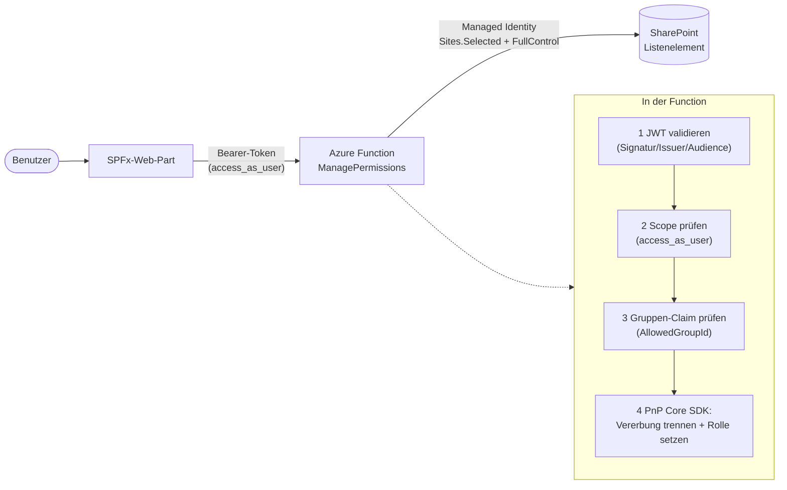

# ManagePermissions

Azure Function (C# / .NET 8 isolated) zum **Setzen und Entfernen von Berechtigungen auf
SharePoint-Listenelementen** – aufrufbar aus einem SPFx-Web-Part.

Die Function vergibt einem Benutzer eine Berechtigungsstufe (z. B. *Mitwirken*) auf einem
einzelnen Listenelement oder stellt dessen Vererbung wieder her. Der Zugriff auf SharePoint
erfolgt **app-only über die Managed Identity** der Function App (least privilege via
**Sites.Selected + FullControl**). Aufrufer werden über ein **Entra-ID-Token** und die
**Mitgliedschaft in einer Sicherheitsgruppe** autorisiert.

## Architektur



Details und Sequenzdiagramm: [docs/architektur.md](docs/architektur.md).

## Aufruf-Vertrag

`POST /api/ManagePermissions` · Header `Authorization: Bearer <Token für api://<client-id>>`

**Berechtigung erteilen (`grant`):**

```json
{
  "action": "grant",
  "webUrl": "https://contoso.sharepoint.com/sites/team",
  "listId": "00000000-0000-0000-0000-000000000000",
  "itemId": 42,
  "userPrincipalName": "user@domain.com",
  "permissionLevel": "Contribute",
  "copyExistingPermissions": true
}
```

Das optionale Feld `copyExistingPermissions` (Default `true`) steuert, ob beim erstmaligen
Trennen der Vererbung die bisher geerbten Zuweisungen übernommen werden. Mit `false` startet
das Element exklusiv – nur der vergebene Benutzer (zzgl. Websitesammlungs-Administratoren)
erhält Zugriff. Das Flag wirkt nur, solange das Element noch erbt; hat es bereits eindeutige
Berechtigungen, wird es ignoriert.

**Vererbung wiederherstellen (`reset`):**

```json
{
  "action": "reset",
  "webUrl": "https://contoso.sharepoint.com/sites/team",
  "listId": "00000000-0000-0000-0000-000000000000",
  "itemId": 42
}
```

**Antworten:** `200 { "ok": true, "message": "..." }` bei Erfolg, sonst nicht-2xx mit
`{ "error": "..." }`.

| Status | Bedeutung |
|---|---|
| `200` | Aktion ausgeführt |
| `400` | Ungültige Eingabe (fehlende Felder, ungültige `listId`/`permissionLevel`, unzulässige `webUrl`) |
| `401` | Kein/ungültiges Token |
| `403` | Gültiges Token, aber Scope oder Gruppenmitgliedschaft fehlt |
| `404` | Liste, Element oder Benutzer nicht gefunden |
| `502` | SharePoint verweigert Zugriff (MI-Berechtigung prüfen) |
| `500` | Unerwarteter Fehler |

### Berechtigungsstufen

Locale-unabhängig über den SharePoint-`RoleType` aufgelöst:

| `permissionLevel` | SharePoint-Rolle |
|---|---|
| `Read` | Lesen |
| `Contribute` | Mitwirken |
| `Edit` | Bearbeiten |
| `Design` | Entwerfen |
| `FullControl` | Vollzugriff |

## Sicherheitsmodell

- **Aufrufer-Authentifizierung:** Eigene Entra-ID-App-Registrierung mit exponiertem Scope
  `access_as_user`. Das SPFx-Web-Part holt per `AadHttpClient` ein Token; die Function
  validiert das JWT **im Code** (`Microsoft.IdentityModel`).
- **Autorisierung:** Nur Mitglieder einer dedizierten **Sicherheitsgruppe**
  (`AzureAd__AllowedGroupId`) dürfen aufrufen (Prüfung des `groups`-Claims).
- **SharePoint-Zugriff:** App-only über die **Managed Identity** (kontrollierte
  Rechte-Erhöhung), begrenzt pro Site via **Sites.Selected + FullControl**.
- **Missbrauchsschutz:** `webUrl` wird gegen eine Host-Allowlist (`SharePoint__AllowedHosts`)
  geprüft.

## Projektstruktur

```
ManagePermissions/
├─ src/ManagePermissions/     # C#-Azure-Function (.NET 8 isolated)
│  ├─ Functions/              # HTTP-Endpunkt ManagePermissions
│  ├─ Auth/                   # JWT-Validierung + Gruppen-Check (CallerAuthorizer)
│  ├─ Services/               # SharePointPermissionService (PnP Core SDK)
│  ├─ Options/                # Konfigurationsmodelle
│  └─ Models/                 # Request-Vertrag
├─ infra/
│  ├─ deploy.ps1              # Resource Group, Storage, App Insights, Function App, MI, CORS
│  └─ grant-sites-selected.ps1# Sites.Selected (Graph + SPO) + Per-Site fullcontrol
├─ docs/
│  ├─ setup.md                # Schritt-für-Schritt-Einrichtung
│  └─ architektur.md          # Architektur, Sequenzdiagramm, Entscheidungen
├─ spfx-sample/               # Minimales SPFx-Web-Part (Aufruf-Beispiel)
└─ README.md
```

## Schnellstart

1. **Entra-App + Sicherheitsgruppe** anlegen → [docs/setup.md](docs/setup.md) Schritte 1–2.
2. **Deployen:**
   ```powershell
   ./infra/deploy.ps1 -ClientId <client-id> -AllowedGroupId <group-id> -SharePointHost <tenant>.sharepoint.com
   ```
3. **MI berechtigen** (frische Session):
   ```powershell
   pwsh -NoProfile -File ./infra/grant-sites-selected.ps1 -FunctionAppName func-wsperms -ResourceGroup rg-workshop -SiteUrl https://<tenant>.sharepoint.com/sites/<sitename>
   ```
4. **Code veröffentlichen:**
   ```powershell
   Set-Location src/ManagePermissions; func azure functionapp publish func-wsperms
   ```
5. **SPFx-Web-Part** bauen, hochladen und API-Berechtigung freigeben → [spfx-sample/README.md](spfx-sample/README.md).

## Lokale Entwicklung

```powershell
Set-Location src/ManagePermissions
Copy-Item local.settings.json.sample local.settings.json   # Werte eintragen
az login                                                    # DefaultAzureCredential nutzt die CLI-Anmeldung
func start
```

Siehe [docs/setup.md](docs/setup.md) Abschnitt 7 für einen Beispielaufruf mit Test-Token.
