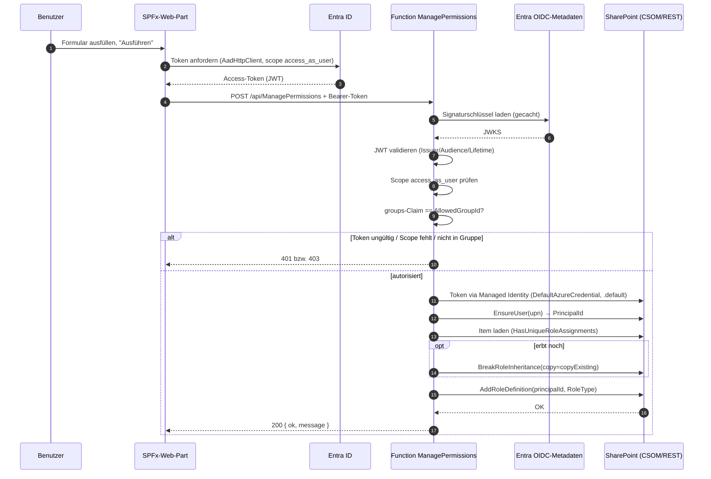

# Architektur – ManagePermissions

## Überblick

`ManagePermissions` ist eine HTTP-Azure-Function (C# / .NET 8 isolated, Flex Consumption),
die Berechtigungen auf einzelnen **SharePoint-Listenelementen** setzt oder zurücksetzt.
Sie ist als geschützte API für ein SPFx-Web-Part konzipiert.

Zwei Vertrauensgrenzen treffen aufeinander:

1. **Aufrufer → Function** (delegiert): Ein Benutzer ruft über das Web-Part auf. Das
   mitgesendete Entra-ID-Token identifiziert den Benutzer; die Function entscheidet anhand
   von Scope und Gruppenmitgliedschaft, ob der Aufruf erlaubt ist.
2. **Function → SharePoint** (app-only): Die Function handelt mit der **Managed Identity**
   der Function App – unabhängig vom Aufrufer, aber eng begrenzt auf einzelne Sites
   (Sites.Selected + FullControl).

Diese Trennung ist eine **kontrollierte Rechte-Erhöhung**: Der Aufrufer braucht selbst keine
Verwaltungsrechte auf der Site; die Function führt die privilegierte Operation stellvertretend
und nur nach erfolgreicher Autorisierung aus.

## Sequenz (grant)

`reset` verläuft analog, ruft aber statt `AddRoleDefinition` ein `ResetRoleInheritance` auf
(idempotent: erbt das Element bereits, passiert nichts).

## Komponenten

| Komponente | Verantwortung |
|---|---|
| `Functions/ManagePermissionsFunction` | HTTP-Eintrittspunkt: Aufrufer prüfen, Body lesen, `grant`/`reset` verteilen, Statuscodes/JSON zurückgeben. |
| `Auth/CallerAuthorizer` | JWT-Validierung im Code (Signatur/Issuer/Audience/Lifetime), Scope- und Gruppen-Prüfung. |
| `Services/SharePointPermissionService` | Eingabevalidierung, PnP-Core-SDK-Operationen, locale-unabhängige Rollenauflösung, Fehler-Mapping. |
| `Options/*` | Stark typisierte Konfiguration (`AzureAd`, `SharePoint`). |
| `Program.cs` | DI-Verdrahtung: Options, Authorizer, PnP Core, Managed-Identity-Tokenprovider. |

## Berechtigungsmodell auf dem Listenelement

SharePoint vererbt Berechtigungen standardmäßig von der Liste an die Elemente. Um ein
**einzelnes Element** abweichend zu berechtigen, muss die Vererbung getrennt werden:

- **grant:** Falls das Element noch erbt → `BreakRoleInheritance(copyRoleAssignments: …,
  clearSubscopes: false)`. Standardmäßig (`copyExistingPermissions: true`) werden die bisher
  geerbten Zuweisungen übernommen, damit vorhandene Zugriffe erhalten bleiben; mit
  `copyExistingPermissions: false` startet das Element exklusiv – nur der vergebene Benutzer
  (zzgl. Websitesammlungs-Administratoren) erhält Zugriff. Anschließend wird die gewünschte
  Rolle für den Benutzer ergänzt. Hinweis: Das Flag wirkt nur im Moment des Trennens – hat das
  Element bereits eindeutige Berechtigungen, wird der Break übersprungen und das Flag ignoriert.
- **reset:** Falls das Element eindeutige Berechtigungen hat → `ResetRoleInheritance()`.
  Danach erbt es wieder von der Liste.

Berechtigungsstufen werden **nicht über lokalisierte Namen** („Mitwirken" vs. „Contribute"),
sondern über den `RoleType` (Reader/Contributor/Editor/WebDesigner/Administrator) aufgelöst –
robust über Sprachgrenzen hinweg.

## Entscheidungen

- **PnP Core SDK statt Microsoft Graph:** Berechtigungsstufen pro Benutzer auf Listenelementen
  (Read/Contribute/…) lassen sich nur über SharePoint-RoleAssignments (CSOM/REST) setzen. Die
  Graph-`permissions`-API kennt nur die groben Selected-App-Rollen (read/write/owner/fullcontrol),
  keine benannten Stufen für einen Benutzer.
- **`GraphFirst = false`:** Das SDK nutzt durchgängig SharePoint-REST. Dadurch braucht die
  Managed Identity nur das **SharePoint**-Recht (Sites.Selected + FullControl) und keine
  zusätzlichen Graph-Rechte.
- **Sites.Selected + FullControl (nicht write):** Das Verwalten von Listenelement-Berechtigungen
  erfordert laut Microsoft-Doku FullControl (oder Owner) auf der Site.
- **Zwei App-Rollen:** Die MI erhält „Sites.Selected" sowohl auf **Microsoft Graph** als auch
  auf **SharePoint Online**. CSOM/SharePoint-REST nutzt ein SharePoint-Audience-Token – die
  Graph-Rolle allein genügt dafür nicht.
- **JWT-Validierung im Code statt Easy Auth:** feingranulare 401-/403-Entscheidungen, gezielte
  Scope-/Gruppen-Prüfung und lokale Testbarkeit ohne Deployment.
- **Gruppen-basierte Autorisierung:** „Nicht jeder darf" wird über die Mitgliedschaft in einer
  dedizierten Sicherheitsgruppe abgebildet – einfach zu verwalten. Über „Groups assigned to the
  application" wird das Group-Overage-Problem vermieden.
- **DefaultAzureCredential:** Managed Identity in Azure, `az login` lokal – derselbe Code läuft
  in beiden Umgebungen.

## Konfiguration

| App Setting | Bedeutung |
|---|---|
| `AzureAd__TenantId` | Mandant, gegen den das Token validiert wird |
| `AzureAd__ClientId` | Client-ID der API-App-Registrierung (erwartete Audience) |
| `AzureAd__RequiredScope` | Erforderlicher Scope (Default `access_as_user`) |
| `AzureAd__AllowedGroupId` | Objekt-ID der berechtigten Sicherheitsgruppe |
| `SharePoint__AllowedHosts` | Komma-getrennte Allowlist erlaubter SharePoint-Hosts |

## Grenzen / Hinweise

- **Eindeutige Berechtigungen pro Liste sind limitiert** (SharePoint-Grenze, Größenordnung
  50.000, empfohlen deutlich darunter). Jedes `grant` auf einem erbenden Element erzeugt einen
  neuen eindeutigen Scope.
- **MI-Token-Cache:** Nach Rollenänderungen kann das MI-Token bis zu ~24 h alt sein
  (`az functionapp stop`/`start` erzwingt ein neues Token).
